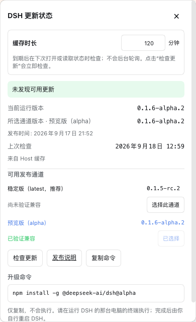

<h1 align="center">DSH Update Status</h1>

<p align="center">A read-only version badge and release-channel guide for the DeepSeek Harness Web sidebar.</p>

<p align="center">
  <a href="https://www.npmjs.com/package/dsh-update-status"></a>
  <a href="https://github.com/idoall/dsh-update-status/actions/workflows/ci.yml"></a>
  <a href="LICENSE"></a>
</p>

<p align="center">English | <a href="README.zh.md">中文</a></p>

<p align="center">
  <a href="#features">Features</a> ·
  <a href="#install">Install</a> ·
  <a href="#usage">Usage</a> ·
  <a href="#security-boundary">Security</a> ·
  <a href="#uninstall">Uninstall</a> ·
  <a href="docs/RELEASING.md">Release guide</a>
</p>

> DSH Update Status is a community plugin for DeepSeek Harness. It does not modify DSH core and it never installs, restarts, rolls back, downloads, or replaces DSH files.

It shadows only the expanded sidebar brand name with `DeepSeek` plus a compact version chip that fits the 24px brand row, leaving the official fish mark untouched. Tap the chip to inspect npm release channels, compatibility status, and a copy-only command for the selected channel.

<p align="center">
  
</p>

## Features

- **Visible version status** — shows the running DSH version in the expanded sidebar and a fallback action in the collapsed rail.
- **Stable and preview discovery** — reads npm dist-tags `latest`, `next`, and `alpha` in one registry request; `latest` is the default.
- **Useful choices only** — hides a non-selected candidate when it equals the running version, and collapses duplicate releases in favor of `latest`.
- **In-panel channel selection** — select a meaningful stable, candidate, or preview release directly in the panel; the preference is stored by the DSH Host.
- **Compatibility labels** — explicitly verified versions are marked verified; unknown preview compatibility is marked unverified rather than claimed safe.
- **Copy-only guidance** — generates an installation-kind-aware `@latest`, `@next`, or `@alpha` command but never executes it.
- **Cache without polling** — one Host check on mount, a configurable 30–1,440 minute cache, single-flight registry access, and no frontend polling. Only the Check for updates button bypasses the cache.
- **Mobile-safe panel** — uses a modal browser top layer so the scrollable, safe-area-aware bottom sheet stays above the DSH drawer.

## Install

Requirements:

- DeepSeek Harness with the Web profile
- Node.js 20 or newer
- Verified DSH release: `0.1.5-rc.1`

With an installed `dsh` command:

```sh
dsh plugin --profile web add dsh-update-status@latest
```

From a DeepSeek Harness source checkout:

```sh
corepack enable
pnpm install
pnpm dsh plugin --profile web add dsh-update-status@latest
```

Restart the existing DSH process after installation, then refresh its Web GUI. Do not start a second Web server for this plugin.

Local development link:

```sh
pnpm install --frozen-lockfile
pnpm run build
dsh plugin --profile web add "link:$(pwd)"
```

## Usage

1. Open the DSH sidebar drawer. The official fish remains in place; the name row shows `DeepSeek` plus the current version badge.
2. Tap the badge. The update panel opens without triggering the parent New Session action.
3. Review meaningful channels. If `next` points to the same release as the running/stable version, it is intentionally omitted.
4. Select `alpha` or another available channel if you want to evaluate it. An unverified preview remains clearly marked.
5. Copy the generated command and run it yourself in a terminal on the computer hosting DSH.
6. Restart DSH yourself after the package-manager command completes.

Example commands generated for a global install:

```sh
npm install -g @deepseek-ai/dsh@latest
npm install -g @deepseek-ai/dsh@next
npm install -g @deepseek-ai/dsh@alpha
```

The plugin displays one command that matches the detected installation kind and selected channel. It does not run these commands.

## Release channels

| Channel | Purpose | Compatibility treatment |
| --- | --- | --- |
| `latest` | Default stable/candidate recommended by the DSH npm package | Verified only when explicitly declared by this plugin |
| `next` | Candidate release when it differs meaningfully from the running/stable release | May be unverified |
| `alpha` | Opt-in preview for early evaluation | Unverified unless explicitly declared otherwise |

The plugin honors npm dist-tags. It does not pick the numerically greatest version from registry history.

## Compatibility

Current release: plugin **`0.1.1`** is verified against DeepSeek Harness **`0.1.5-rc.1`**.

| Plugin | Verified DeepSeek Harness |
| --- | --- |
| `0.1.0` | `0.1.2-rc.1` |
| `0.1.1` | `0.1.5-rc.1` |

Use `0.1.1` with DSH `0.1.5-rc.1`. Keep `0.1.0` only if you are still on DSH `0.1.2-rc.1`. A newer DSH version is not automatically declared compatible. Verify it manually first. If the plugin is incompatible, disable or uninstall it rather than patching DSH core.

## Configuration

| Option | Default | Range / behavior |
| --- | --- | --- |
| `cacheTtlMinutes` | `360` | 30–1,440 minutes; expires only for the next on-demand read, never a background timer |
| `channel` | `latest` | `latest`, `next`, or `alpha` |
| `sidebarEnabled` | `true` | Hides only this plugin's sidebar entry |

**Settings → Version & updates** lets the local operator hide the plugin's sidebar entry and select a release channel. The panel also supports direct channel selection and a cache-duration input. Changing the duration does not issue a request; only a later normal read can refresh an expired cache, while **Check for updates** always performs an immediate manual refresh.

## Security boundary

- Registry access is limited to HTTPS `registry.npmjs.org`; redirects are rejected.
- The Host returns ordinary JSON over the authenticated DSH Connection RPC channel.
- There is no public Remote Service and no model Tool.
- No package-manager process is spawned by plugin code.
- `canApplyInPlace` is always `false`.
- There is no Update now button, automatic install, restart, rollback, or release-file replacement.
- A failed refresh retains the last good cache and displays a warning; a cold failure still shows the local version.

## Uninstall

```sh
dsh plugin --profile web remove dsh-update-status
```

Restart DSH and refresh the Web GUI. If desired, remove the `dsh-update-status` settings namespace from `~/.dsh/settings.yaml` after uninstalling.

## Development

```sh
pnpm install --frozen-lockfile
pnpm run test
pnpm run build
pnpm pack --dry-run
```

Release tags use npm Trusted Publishing with GitHub OIDC. See [docs/RELEASING.md](docs/RELEASING.md) to configure npm’s Trusted Publisher once, then push a matching `vX.Y.Z` tag; no long-lived npm token is stored in this repository.

MIT. See [LICENSE](LICENSE).
