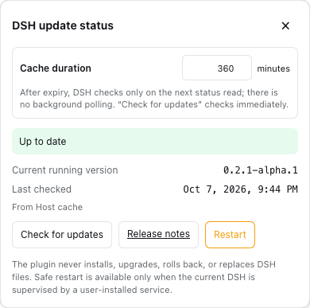

<h1 align="center">DSH Update Status</h1>

<p align="center">A DSH Web version-status panel with copy-only upgrade guidance and opt-in, supervised safe restart.</p>

<p align="center">
  <a href="https://www.npmjs.com/package/dsh-update-status"></a>
  <a href="https://github.com/idoall/dsh-update-status/actions/workflows/ci.yml"></a>
  <a href="LICENSE"></a>
</p>

<p align="center">English | <a href="README.zh.md">中文</a></p>

<p align="center">
  <a href="#features">Features</a> ·
  <a href="#install">Install</a> ·
  <a href="#usage">Usage</a> ·
  <a href="#update-check">Update check</a> ·
  <a href="#supervised-restart">Supervised restart</a> ·
  <a href="#lan--non-loopback-pages">LAN pages</a> ·
  <a href="#compatibility">Compatibility</a> ·
  <a href="#configuration">Configuration</a> ·
  <a href="#troubleshooting">Troubleshooting</a> ·
  <a href="#security-boundary">Security</a> ·
  <a href="#uninstall">Uninstall</a> ·
  <a href="docs/RELEASING.md">Release guide</a>
</p>

> DSH Update Status is a community plugin for DeepSeek Harness. It does not modify DSH core, install or upgrade DSH, roll back DSH packages, download releases, or replace DSH files. It can request a **safe restart only after you explicitly install a verified user-level service** to supervise the current DSH Web process.

It shadows only the expanded sidebar brand name with `DeepSeek` plus a compact version chip that fits the 24px brand row, leaving the official fish mark untouched. A green dot next to the version means the running release is the newest one npm publishes; a breathing amber dot means a newer release exists — stable, release candidate or alpha. Tap the chip for the running version, the newer release, whether this plugin was verified against it, a copy-only upgrade command pinned to that exact version, and the guarded **Restart** control that appears once you have installed user-level supervision.

<p align="center">
  
</p>

## Features

- **Visible version status** — shows the running DSH version in the expanded sidebar. Nothing is rendered while the sidebar is collapsed: DSH's `sidebar.footer.action` row is a single 36px cell above Settings, and a second registrant overflows it (it pushed a neighbouring plugin's entry off the screen edge), so the brand-row chip is the only entry.
- **Quiet update signal** — a pending update never repaints the version chip. Only an amber dot with a soft halo next to the version breathes (scale + glow; the animation is disabled under `prefers-reduced-motion`), so a new release reads as one small light instead of a recoloured brand row.
- **Three dot states, one glance** — with nothing to do the dot beside the version is a plain **green circle** (the theme's success colour, not the text colour, so a dark shell no longer paints a dot that reads as "off"). While a check is running it is the neutral grey pulse; a pending update is the amber halo. Only the update state animates or glows, and only a failed status read repaints the chip, in red.
- **Neutral chip surface** — the chip is a grey second-level surface in both themes (`#f1f3f5` light / `#353638` dark) with the theme's normal label colour, so the dark shell gets a dark grey chip with white text rather than a white pill that hides the amber halo.
- **Light, dark, or system — followed automatically** — every colour the plugin renders is a DSH semantic token, so the chip, the dot, its halo and the panel all resolve through whatever appearance DSH is using. Set DSH to light, to dark, or to system and the plugin switches with the shell: no plugin-side theme setting, no media query to keep in sync. Hover lifts the chip in both directions (darkened in light mode, lightened in dark mode) by mixing the theme's label colour into the surface.
- **One release line, zero configuration** — reads npm's dist-tags in one registry request and keeps only the newest published version, stable, release candidate or alpha alike. There is no channel to follow and no choice to make.
- **An honest prerelease comparison** — the running version and that newest version are ordered with SemVer, so `0.2.1-alpha.1` outranks `0.2.0-rc.2` and a release candidate still sorts below its own stable release.
- **Compatibility labels** — a release this plugin was verified against is marked verified; an untested newer one is marked unverified rather than claimed safe, and that advisory never repaints the chip.
- **Copy-only guidance** — generates an installation-kind-aware command for the exact newer version it found, never a dist-tag that can move, and never executes it.
- **Cache without polling** — one Host check on mount, a configurable 30–1,440 minute cache, single-flight registry access, and no frontend polling. Only the Check for updates button bypasses the cache.
- **Mobile-safe panel** — uses a modal browser top layer so the scrollable, safe-area-aware bottom sheet stays above the DSH drawer.
- **Supervised safe restart** — after a one-time service setup, the panel can restart DSH for you: it warns about the work it would interrupt, and refuses outright when DSH was started by hand or by the desktop app.

## Install

Requirements:

- DeepSeek Harness with the Web profile
- Node.js 20 or newer
- Verified DSH releases: `0.2.1-alpha.1` (current), `0.2.0-rc.2`, `0.2.0-rc.1`, `0.1.7-rc.2`, `0.1.7-rc.1` and `0.1.7-alpha.2`

With an installed `dsh` command:

```sh
dsh plugin --profile web add dsh-update-status@latest
```

From a DeepSeek Harness source checkout:

```sh
corepack enable
pnpm install
pnpm dsh plugin --profile web add dsh-update-status@latest
```

Restart the existing DSH process after installation, then refresh its Web GUI. Do not start a second Web server for this plugin.

Local development link:

```sh
pnpm install --frozen-lockfile
pnpm run build
dsh plugin --profile web add "link:$(pwd)"
```

## Usage

1. Open the DSH sidebar drawer. The official fish remains in place; the name row shows `DeepSeek` plus the current version badge.
2. Tap the badge. The update panel opens without triggering the parent New Session action.
3. Read the running version. When it is the newest release npm publishes, the panel says so and offers nothing to run.
4. When a newer release exists — stable, release candidate or alpha — the panel names it, its publish date, and whether this plugin was verified against it.
5. Copy the generated command, which is pinned to that exact version, and run it yourself in a terminal on the computer hosting DSH.
6. After the package-manager command completes, use the panel's **Restart** control only if you have completed [supervised restart](#supervised-restart); otherwise restart DSH yourself.

Example commands generated for a global install:

```sh
npm install -g @deepseek-ai/dsh@0.2.1-alpha.1
```

The plugin displays one command that matches the detected installation kind and names the exact release it found. It does not run it.

### What the dot means

The dot beside the version carries the whole status, and only the update state animates:

| Dot | State | Meaning |
| --- | --- | --- |
| green circle | up to date | The running release is the newest one npm publishes. The chip keeps its normal fill. |
| grey pulse | checking | A status read is in flight (first mount or **Check for updates**). |
| amber dot with a halo | update | A newer release exists. Copy the command, run it yourself, restart DSH. |
| chip turns red | failed read | The plugin could not determine the state: the registry read failed or the two versions are not SemVer-comparable. An *unverified* newer release is not this case — it is an advisory shown only in the panel. |

<p align="center">
  
</p>

The chip itself is a neutral second-level surface — grey in both themes, with the theme's own label colour — so the amber halo always reads against it, and it never changes colour to announce an update.

## Update check

The plugin asks the npm registry for `@deepseek-ai/dsh` once per cache window, keeps the **newest version any dist-tag points at**, and compares it with the running release. `latest`, `next` and `alpha` are npm bookkeeping, not a user choice: a newer release is reported whichever tag carries it.

- The highest SemVer wins, prereleases included, so an `alpha` ahead of the stable line is offered rather than hidden.
- The comparison is exact: `0.2.1-alpha.1` is newer than `0.2.0-rc.2`, and both sort below `0.2.1`.
- A dist-tag the plugin has never heard of still counts — the read takes every tag npm returns, not a fixed triple.
- Only a version this plugin was verified against is labelled verified. An untested newer release is offered with an *unverified* advisory (`notice`, which never repaints the chip).
- The panel and the settings section render the same single answer; the upgrade command names the exact version found.

Nothing here installs anything. Choosing to follow a channel — and the `channel` preference that stored it — was removed in `0.2.0`.

## Supervised restart

A plugin cannot restart DSH on its own: it lives inside the very process it would have to replace. So the button only works once your operating system owns that process — and every OS already ships a way to do that.

The shortest safe setup is explicit and terminal-driven:

```sh
# 1. Inspect the complete native-service plan. This writes and starts nothing.
dsh plugin --profile web exec dsh-update-status-service plan \
  --workspace "$PWD" --dry-run

# 2. Stage the user-service definition. This still does not start it.
dsh plugin --profile web exec dsh-update-status-service install \
  --workspace "$PWD"

# 3. Stop the terminal-started dsh web yourself, then activate the service.
dsh plugin --profile web exec dsh-update-status-service activate \
  --workspace "$PWD"
```

`activate` stops if the port is still busy instead of killing anything, so the DSH you are already using is never taken down by surprise. It also checks afterwards that the service it just started really took over; a service that begins failing immediately is reported as a failure, not as a success. From then on, **Restart** lists what is running, asks for a second confirmation when something is, and lets DSH exit; the service starts it again and the page comes back on its own.

Only one thing may start DSH Web on that port. If another tool starts its own `dsh web` — a second plugin's restart helper, a `nohup` script — that process holds the port while your service keeps failing to start. The plugin asks your operating system which process the service really owns, so **Restart** stays disabled in that state instead of promising a recovery that cannot happen, and it shows the two copy-only commands that fix it: one to find whoever holds the port, one to give the service back. The generated service also stops after a few failed starts in a row rather than respawning forever, and writes the reason to its log. Settings shows when the service started, so a fresh restart and a long-running instance are easy to tell apart. More detail: [user-service supervision](docs/service-supervision.md).

| Platform | User-level owner | Starts | Restart works after setup | Notes |
| --- | --- | --- | --- | --- |
| macOS | `launchd` LaunchAgent | at user login | Yes | First verified target; no administrator account required. |
| Linux | `systemd --user` | at user login | Implemented; verify on your host | `loginctl enable-linger` is optional for running after logout and is never enabled automatically. The unit template is render-tested but has not been run on a real Linux host yet. |
| Windows | Task Scheduler + current-user wrapper | at user logon | Template supplied; verify on Windows before production use | No administrator account required. |

The generated service files contain absolute paths and **no secrets** — never your API keys, npm tokens, cookies or proxy credentials. Native files, logs, status and removal: [user-service supervision](docs/service-supervision.md). To check Linux or Windows on your own machine: [platform acceptance](docs/platform-acceptance.md).

A restart interrupts running work and does not save it. If DSH cannot list what is running, cannot verify that your service owns the current process, or was started by hand or by the desktop app, it refuses to restart at all — a web page cannot talk it into it.

## LAN / non-loopback pages

DSH disables Host settings persistence for any page whose origin is not a loopback authority (the official `dsh-client-ui-settings` README states it plainly: *Non-loopback pages get no durable settings*). Every entry-addressed form (`ctx.configForms.get(id)`, the DSH 0.1.7 successor of the removed `settingsScope` service) is then pinned to `memory`, answers `unavailable`, and never sends `settings.describe`, and `connection.isLoopback` reads false for the whole page.

From `0.1.2` this plugin is fully usable there anyway:

- The version/update **status** is fetched normally. Earlier releases gated the whole feature on `connection.isLoopback === true`, so a page reached through a LAN bridge (`dsh-bridge`, `dsh-lan-proxy`, …) never sent `POST /api/dsh-update-status.get-status`, could not open the detail panel, and showed this bundle's declared compatible release as if it were the running version. That gate is gone — the Connection RPC is authenticated and the Host route is the plugin's own.
- **Preferences** (`sidebarEnabled`, `cacheTtlMinutes`) keep reading and writing the ONE shared Host settings entry `dsh-update-status`, through the same public Remote the official settings form speaks (`settings.describe` / `settings.mutate`). Writes stay revision-fenced, and a refused write surfaces as a conflict instead of a silent overwrite. The direct channel opens only when the official form reports `unavailable`, so a loopback page keeps the official path and pays no extra wire read.

If you want DSH's stock policy instead (a non-loopback page never persists settings), let the bridge declare itself the Host: inject `window.__DSH_TRANSPORT__ = { fetch: (input, init) => window.fetch(input, init), ownsHost: true }` into the served HTML before `__DSH_BOOT__`. DSH's `ctx.connection.isLoopback` then reads true and every settings-backed surface — including the official Settings pages — comes back. The `dsh-mobile` gateway already does this.

## Compatibility

Current release: plugin **`0.3.2`** is verified against DeepSeek Harness **`0.2.1-alpha.1`** (the current release), **`0.2.0-rc.2`**, **`0.2.0-rc.1`**, **`0.1.7-rc.2`**, **`0.1.7-rc.1`** and **`0.1.7-alpha.2`**.

### Which plugin version goes with which DeepSeek Harness version

| Plugin | Verified DeepSeek Harness | On npm | What that version is |
| --- | --- | --- | --- |
| **`0.4.0`** | `0.2.1-alpha.1`, `0.2.0-rc.2`, `0.2.0-rc.1`, `0.1.7-rc.2`, `0.1.7-rc.1`, `0.1.7-alpha.2` | `latest` | Restart you can trust: the service stops instead of restarting forever, the button needs the service to really own the process, and a disabled button shows the two commands that recover it. Settings also shows when the service started |
| **`0.3.2`** | `0.2.1-alpha.1`, `0.2.0-rc.2`, `0.2.0-rc.1`, `0.1.7-rc.2`, `0.1.7-rc.1`, `0.1.7-alpha.2` | published | Documentation only: the version table and every past release note are now plain language. Behaves exactly like `0.3.1` |
| **`0.3.1`** | `0.2.1-alpha.1`, `0.2.0-rc.2`, `0.2.0-rc.1`, `0.1.7-rc.2`, `0.1.7-rc.1`, `0.1.7-alpha.2` | published | Small polish: the settings page explains Restart too, and a long job name can no longer push the buttons away. |
| **`0.3.0`** | `0.2.1-alpha.1`, `0.2.0-rc.2`, `0.2.0-rc.1`, `0.1.7-rc.2`, `0.1.7-rc.1`, `0.1.7-alpha.2` | published | Adds **Restart** to the panel, plus the one-command service setup it needs. Without that service the button stays disabled and says why. |
| **`0.2.1`** | `0.2.1-alpha.1`, `0.2.0-rc.2`, `0.2.0-rc.1`, `0.1.7-rc.2`, `0.1.7-rc.1`, `0.1.7-alpha.2` | published | Hiding the version chip brings DSH’s own name and fish mark back, instead of leaving the brand row blank. |
| **`0.2.0`** | `0.2.1-alpha.1`, `0.2.0-rc.2`, `0.2.0-rc.1`, `0.1.7-rc.2`, `0.1.7-rc.1`, `0.1.7-alpha.2` | published | One update line instead of a channel picker: the panel reports whatever version npm publishes newest, and there is nothing to configure. |
| **`0.1.12`** | `0.2.0-rc.2`, `0.2.0-rc.1`, `0.1.7-rc.2`, `0.1.7-rc.1`, `0.1.7-alpha.2` | published | Adds DSH `0.2.0-rc.2` to the verified list; no code change. |
| **`0.1.11`** | `0.2.0-rc.1`, `0.1.7-rc.2`, `0.1.7-rc.1`, `0.1.7-alpha.2` | published | Declares the DSH `0.2.0` line and widens the supported range, so a newer DSH can no longer drop the plugin without a word. |
| **`0.1.10`** | `0.1.7-rc.2`, `0.1.7-rc.1`, `0.1.7-alpha.2` | published | No more button in the collapsed sidebar rail — it did not fit there and pushed a neighbouring plugin’s icon aside. |
| `0.1.9` | `0.1.7-rc.2`, `0.1.7-rc.1`, `0.1.7-alpha.2` | published | Fixes the plugin disappearing after a DSH upgrade (a leftover copy of a shared library could take it down), and the settings page now says which folder to delete. |
| `0.1.8` | `0.1.7-rc.2`, `0.1.7-rc.1`, `0.1.7-alpha.2` | published | Adds DSH `0.1.7-rc.2` to the verified list; no code change. |
| `0.1.7` | `0.1.7-rc.1`, `0.1.7-alpha.2` | published | The English UI is fully English now: status messages are rendered by the browser in its own language. |
| `0.1.6` | `0.1.7-rc.1`, `0.1.7-alpha.2` | published | Adapts to DSH 0.1.7, where the plugin’s two preferences are stored as its own settings entry. |
| `0.1.5` | `0.1.6-alpha.2`, `0.1.6-alpha.1`, `0.1.5-rc.1` | published | One dot carries every state (green up to date, grey checking, amber for an update), and advisory notices stop recolouring the chip. |
| `0.1.4` | `0.1.6-alpha.1`, `0.1.5-rc.1` | published | Fixes the entry for the version you are running showing as unselectable. |
| `0.1.3` | `0.1.6-alpha.1`, `0.1.5-rc.1` | published | Carries the LAN-page fix and re-verifies it on DSH 0.1.6. |
| `0.1.2` | `0.1.5-rc.1` | **never published** | Removes the loopback-only restriction, so a LAN page works too. |
| `0.1.1` | `0.1.5-rc.1` | published | The previous npm `latest`; on a LAN page the plugin does nothing. |
| `0.1.0` | `0.1.2-rc.1` | published | First release. |
- **Which version goes with which DSH?** `0.1.6`–`0.1.10` are for the DSH `0.1.7` line; `0.1.11` and later also declare the `0.2.0` line. DSH 0.1.7 changed how a plugin stores its settings, so on an older DSH — including `0.1.6-alpha.2` — stay on plugin **`0.1.5`**.
- **"Verified"** means that exact DSH release was tested with this build. A release that is missing from the list is shown as *unverified compatible* — a note in the panel only, which never recolours the chip — so upgrading DSH ahead of the plugin is safe to try. If a release turns out genuinely incompatible, disable or uninstall the plugin rather than editing DSH itself. (The list is kept in `package.json` and `src/shared/types.ts`, in sync by a test.)
- **On npm** means what `dsh plugin --profile web add dsh-update-status@latest` actually installs. A version that exists in this repository but not on npm is a development state, not a release.

- Match them explicitly when it matters:

  ```sh
  dsh plugin --profile web add dsh-update-status@0.3.2   # DSH 0.2.1-alpha.1
  dsh plugin --profile web add dsh-update-status@0.2.0   # DSH 0.2.1-alpha.1, 0.2.0-rc.2, 0.2.0-rc.1, 0.1.7-rc.2, 0.1.7-rc.1 or 0.1.7-alpha.2
  dsh plugin --profile web add dsh-update-status@0.1.12 # DSH 0.2.0-rc.2, 0.2.0-rc.1, 0.1.7-rc.2, 0.1.7-rc.1 or 0.1.7-alpha.2
  dsh plugin --profile web add dsh-update-status@0.1.11 # DSH 0.2.0-rc.1, 0.1.7-rc.2, 0.1.7-rc.1 or 0.1.7-alpha.2
  dsh plugin --profile web add dsh-update-status@0.1.10  # DSH 0.1.7-rc.2, 0.1.7-rc.1 or 0.1.7-alpha.2
  dsh plugin --profile web add dsh-update-status@0.1.9   # DSH 0.1.7-rc.2, 0.1.7-rc.1 or 0.1.7-alpha.2
  dsh plugin --profile web add dsh-update-status@0.1.8   # DSH 0.1.7-rc.2, 0.1.7-rc.1 or 0.1.7-alpha.2
  dsh plugin --profile web add dsh-update-status@0.1.7   # DSH 0.1.7-rc.1 or 0.1.7-alpha.2
  dsh plugin --profile web add dsh-update-status@0.1.6   # DSH 0.1.7-rc.1 or 0.1.7-alpha.2
  dsh plugin --profile web add dsh-update-status@0.1.5   # DSH 0.1.6-alpha.2, 0.1.6-alpha.1 or 0.1.5-rc.1
  dsh plugin --profile web add dsh-update-status@0.1.4   # DSH 0.1.6-alpha.1 or 0.1.5-rc.1
  dsh plugin --profile web add dsh-update-status@0.1.0   # DSH 0.1.2-rc.1 only
  ```

- Two declarations make the verified lines load at all, and a test keeps them honest:
  - `dsh.engines.dsh` and `peerDependencies['@deepseek-ai/dsh-settings']` both declare `>=0.1.7-alpha.2 <0.3.0`, which admits all six verified releases. The lower bound names the alpha on purpose — under node-semver's default prerelease rule a range like `>=0.1.6-0 <0.2.0` does **not** admit `0.1.7-alpha.2`. The upper bound moved from `<0.2.0` to `<0.3.0` in `0.1.11` for the mirror-image reason: DSH refuses an incompatible bundle at profile load, and a plain `<0.2.0` excludes the `0.2.0` stable, so the day DSH `0.2.0` shipped the plugin would have been silently dropped. DSH evaluates the range with `includePrerelease: true`, so `0.2.0-rc.2` was already inside it and `0.1.12` needed no range change; conversely, a bundle that enumerates `... || 0.2.0-rc.1 || >=0.2.0 <0.3.0` is refused on rc.2, because `>=0.2.0` does not admit a `0.2.0` prerelease.
  - `@deepseek-ai/schemastery` is a **peer**, not a plain dependency: DSH 0.1.7 resolves only a linked plugin's peer dependencies from the running installation, so a `link:` install of this directory would otherwise fail to import the Host half.
- Per-release notes — what changed, who is affected, what to do — are hand-written in Chinese and English and become the GitHub Release body: [`v0.3.0`](https://github.com/idoall/dsh-update-status/blob/main/docs/releases/v0.3.2.md) · [v0.3.1](https://github.com/idoall/dsh-update-status/blob/main/docs/releases/v0.3.1.md) · [v0.3.0](https://github.com/idoall/dsh-update-status/blob/main/docs/releases/v0.3.0.md) · [`v0.2.1`](https://github.com/idoall/dsh-update-status/blob/main/docs/releases/v0.2.1.md) · [`v0.2.0`](https://github.com/idoall/dsh-update-status/blob/main/docs/releases/v0.2.0.md) · [`v0.1.12`](https://github.com/idoall/dsh-update-status/blob/main/docs/releases/v0.1.12.md) · [`v0.1.11`](https://github.com/idoall/dsh-update-status/blob/main/docs/releases/v0.1.11.md) · [`v0.1.10`](https://github.com/idoall/dsh-update-status/blob/main/docs/releases/v0.1.10.md) · [`v0.1.9`](https://github.com/idoall/dsh-update-status/blob/main/docs/releases/v0.1.9.md) · [`v0.1.8`](https://github.com/idoall/dsh-update-status/blob/main/docs/releases/v0.1.8.md) · [`v0.1.7`](https://github.com/idoall/dsh-update-status/blob/main/docs/releases/v0.1.7.md) · [`v0.1.6`](https://github.com/idoall/dsh-update-status/blob/main/docs/releases/v0.1.6.md) · [`v0.1.5`](https://github.com/idoall/dsh-update-status/blob/main/docs/releases/v0.1.5.md) · [`v0.1.4`](https://github.com/idoall/dsh-update-status/blob/main/docs/releases/v0.1.4.md) · [`v0.1.3`](https://github.com/idoall/dsh-update-status/blob/main/docs/releases/v0.1.3.md) (covers the never-published `0.1.2`).

## Configuration

| Option | Default | Range / behavior |
| --- | --- | --- |
| `cacheTtlMinutes` | `360` | 30–1,440 minutes; expires only for the next on-demand read, never a background timer |
| `sidebarEnabled` | `true` | Hides only this plugin's sidebar entry; the brand row falls back to DSH's own mark and wordmark |

**Settings → Version & updates** shows the running version, the check result and the upgrade command, and lets the local operator hide the plugin's sidebar entry (DSH's own brand returns while it is hidden). The panel adds the cache-duration input. Changing the duration does not issue a request; only a later normal read can refresh an expired cache, while **Check for updates** always performs an immediate manual refresh.

A preference is written only by your own selection in the panel or in that settings section. The plugin has no automatic write path — no effect, timer, or mount-time write — and `tests/client/entry.spec.ts` mounts the real client entry to keep it that way. On DSH 0.1.7 the two preferences above are the **volatile** fields of this plugin entry's `Config`, so they persist as that entry's `config` in the active profile's patch (`~/.dsh/profiles/<profile>/cordis.patch.yml`); edit or remove that block to reset a preference, and DSH reloads the profile on the next change. The remaining `Config` fields are deployment-only and never appear in the form: `cacheTtlHours` (default `6`), `timeoutMs` (default `15000`) and `autoCheckOnMount` (default `true`), all set in the same profile patch.

## Troubleshooting

**The chip shows a version that is not what I just installed, and tapping it does nothing.**
That is the `connection.isLoopback` gate from plugin `0.1.1` and earlier: on a non-loopback page such as a LAN bridge (`dsh-bridge`, `dsh-lan-proxy`) the whole plugin goes inert and the chip falls back to this bundle's declared compatible release. Check what is installed and upgrade:

```sh
node -p "require(process.env.HOME + '/.dsh/profiles/web/node_modules/dsh-update-status/package.json').version"   # 0.1.3 or newer
dsh plugin --profile web add dsh-update-status@latest
```

**The chip turned red right after I upgraded DSH.**
On `0.1.5` and newer a red chip means one thing: the plugin could not determine the update state — the registry read failed, or the two versions are not SemVer-comparable. Up to `0.1.4` the rule was broader: the client treated **any** warning as a problem, and *"this preview has not been verified against the plugin"* is exactly the warning a DSH release newer than the plugin's list produces. Upgrading DSH ahead of the plugin therefore painted the chip red even though the read had succeeded. `0.1.5` splits the two — `failure` still repaints, an advisory stays in the panel — so upgrade if you keep DSH ahead of this plugin:

```sh
dsh plugin --profile web add dsh-update-status@latest
```

Until then the advisory is harmless: it appears in the panel only, and disappears as soon as a later plugin release declares your DSH release as verified.

**The version never changes.**
The Host caches one registry response, 360 minutes by default, and only a normal read can expire it. Press **Check for updates** for an immediate refresh, or lower `cacheTtlMinutes`. A failed check keeps the last good cache and shows the warning next to the version.

**Nothing reaches the npm registry.**
The plugin reports the failure and still shows the locally detected running version. Registry access is HTTPS-only to `registry.npmjs.org`; a proxy or offline host produces that warning rather than a wrong version.

**The plugin disappeared after an upgrade, and the host log says `volatile is not a function`.**
Up to `0.1.5` this plugin declared `@deepseek-ai/schemastery` as a regular dependency. From `0.1.6` it is a **peer that DSH provides**, and the `volatile()` DSH adds to it is what turns the two preferences into this entry's settings form. If a copy of that package is left inside the plugin's own install directory — a dev `node_modules` copied in by a local-directory install, which pnpm never removes — Node used to resolve that stale copy, and the missing method threw while the host half was being imported, so the plugin disappeared before it could report anything at all. Newer builds resolve the platform copy explicitly and load either way, and when only a stale copy is reachable the panel shows a `stale-schemastery` notice naming the directory. Remove the leftover copy and restart DSH:

```sh
rm -rf ~/.dsh/profiles/<profile>/node_modules/dsh-update-status/node_modules
```

## Security boundary

- Registry access is limited to HTTPS `registry.npmjs.org`; redirects are rejected.
- The Host returns ordinary JSON over the authenticated DSH Connection RPC channel.
- There is no public Remote Service and no model Tool.
- No package-manager process is spawned by plugin code.
- `canApplyInPlace` is always `false`.
- The plugin never installs, upgrades, rolls back, or replaces DSH files. Its separate, explicitly invoked service CLI stages only current-user service definitions; it never kills an occupied DSH port.
- Restart requests travel over DSH's authenticated channel and are re-checked by the Host itself: a hand-started, desktop, or un-inspectable DSH refuses to exit even when a page asks it to.
- A failed refresh retains the last good cache and displays a warning; a cold failure still shows the local version.

## Uninstall

```sh
dsh plugin --profile web remove dsh-update-status
```

Restart DSH and refresh the Web GUI. Uninstalling does not delete the preferences: to wipe them, remove the `dsh-update-status` entry's `config` block from the active profile's `cordis.patch.yml`.

## Development

```sh
pnpm install --frozen-lockfile
pnpm run test
pnpm run build
pnpm pack --dry-run
```

Release tags use npm Trusted Publishing with GitHub OIDC. See [docs/RELEASING.md](docs/RELEASING.md) to configure npm’s Trusted Publisher once, then push a matching `vX.Y.Z` tag; no long-lived npm token is stored in this repository.

MIT. See [LICENSE](LICENSE).
