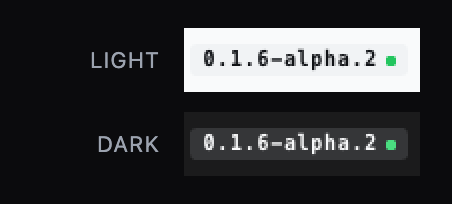

<h1 align="center">DSH Update Status</h1>

<p align="center">DeepSeek Harness Web 侧栏中的只读版本状态 Badge 与发布通道指南。</p>

<p align="center">
  <a href="https://www.npmjs.com/package/dsh-update-status"></a>
  <a href="https://github.com/idoall/dsh-update-status/actions/workflows/ci.yml"></a>
  <a href="LICENSE"></a>
</p>

<p align="center"><a href="README.md">English</a> | 中文</p>

<p align="center">
  <a href="#功能">功能</a> ·
  <a href="#安装">安装</a> ·
  <a href="#使用">使用</a> ·
  <a href="#发布通道">发布通道</a> ·
  <a href="#局域网非回环页面访问">局域网访问</a> ·
  <a href="#兼容性">兼容性</a> ·
  <a href="#配置">配置</a> ·
  <a href="#故障排查">故障排查</a> ·
  <a href="#安全边界">安全边界</a> ·
  <a href="#卸载">卸载</a> ·
  <a href="docs/RELEASING.md">发布指南</a>
</p>

> DSH Update Status 是 DeepSeek Harness 社区插件。它不修改 DSH 核心，也绝不会安装、重启、回滚、下载或替换 DSH 文件。

插件只把展开侧栏中的品牌名称换成适配 24px 品牌行的 `DeepSeek + 版本芯片`，官方鱼标保持不变。版本号旁的**绿点**表示无事可做，**橙色呼吸圆点**表示线上有新版本。点击芯片可查看 npm 发布通道、兼容性状态，以及与所选通道对应的“仅复制”命令。

<p align="center">
  
</p>

## 功能

- **侧栏版本状态**：展开侧栏显示当前 DSH 版本，收起轨道提供状态入口。
- **安静的更新提示**：有新版本时**不改变版本 Badge 的背景**，只在版本号旁保留一个带小光晕的橙色圆点做放大缩小的呼吸动画（`prefers-reduced-motion` 下停用动画），让新版本表现为一盏小灯，而不是整条品牌行换色。
- **一眼三态**：没有可做的事时，版本号旁是**纯绿色小圆圈**（取主题 success 色，不再跟随文字色——暗色外壳下不会再出现一个看起来像「熄灭」的深色点）；检查中是中性灰呼吸点；有新版本才是橙色光晕呼吸点。只有更新态会动、会发光，也只有状态读取失败才会把 Badge 重绘成红色。
- **中性版本底框**：Badge 在明暗两套主题下都用灰色二级面（浅色 `#f1f3f5` / 深色 `#353638`）配主题常规文字色，所以暗色下是「深灰底 + 白字」，不再是会把橙色光晕吃掉的白框；只有状态读取失败时才会重绘成红色。
- **浅色 / 深色 / 跟随系统，自动适配**：插件渲染的每个颜色都是 DSH 语义令牌，Badge、圆点、光晕、收起轨道圆环与面板都按 DSH 当前外观解析。DSH 设为浅色、深色或跟随系统，插件就跟着切换——插件侧没有自己的主题开关，也没有需要同步的媒体查询。hover 在两个方向上都是「抬起」：浅色下压深、深色下提亮（把主题文字色按比例混进底色实现）。
- **稳定版与预览版发现**：一次 registry 请求读取 npm dist-tags `latest`、`next`、`alpha`，默认选择 `latest`。
- **只展示有意义的选择**：按版本号去重；`latest` 与你当前跟随的通道始终保留，并且**不会隐藏与你正在运行的版本相符的那条通道**。
- **弹窗内直接选择通道**：可直接选择有价值的稳定版、候选版或预览版；偏好由 DSH Host 持久化。
- **兼容性标识**：明确验证过的版本显示“已验证兼容”；未知预览版显示“尚未验证兼容”，不冒充安全升级。
- **仅复制命令**：根据安装来源和通道生成 `@latest`、`@next` 或 `@alpha` 命令，但从不执行。
- **缓存但不轮询**：Host 挂载时检查一次，缓存可设为 30–1,440 分钟并合并并发请求；前端没有轮询，只有“检查更新”按钮绕过缓存。
- **移动端可靠**：详情使用浏览器 modal top layer；底部 sheet 可滚动、适配 safe area，并保持在 DSH 抽屉上方。

## 安装

要求：

- 带 Web profile 的 DeepSeek Harness
- Node.js 20 或更新版本
- 已验证的 DSH 版本：`0.1.7-rc.2`（最新 RC）、`0.1.7-rc.1` 与 `0.1.7-alpha.2`

已经安装 `dsh` 命令：

```sh
dsh plugin --profile web add dsh-update-status@latest
```

直接使用 DeepSeek Harness 源码：

```sh
corepack enable
pnpm install
pnpm dsh plugin --profile web add dsh-update-status@latest
```

安装后重启原有 DSH 进程，再刷新 Web GUI。不要为本插件启动第二个 Web server。

本地开发 link：

```sh
pnpm install --frozen-lockfile
pnpm run build
dsh plugin --profile web add "link:$(pwd)"
```

## 使用

1. 打开 DSH 左侧抽屉。官方鱼标仍在；名称行显示 `DeepSeek + 当前版本 Badge`。
2. 点击 Badge。面板打开时不会触发外层“新建会话”按钮。
3. 查看可选的通道。列表按版本号去重，`latest` 与你当前跟随的通道始终在列，且与你正在运行的版本相符的那条通道一定可选。
4. 想跟随某个通道（例如 `alpha`）就在面板里直接选它。该选择由 DSH Host 持久化，只影响后续检查；未验证兼容的预览版仍会明确标注。
5. 复制生成的命令，在**运行 DSH 的那台电脑**的终端中自行执行。
6. 包管理器命令完成后，由你自行重启 DSH。

全局安装时可能生成：

```sh
npm install -g @deepseek-ai/dsh@latest
npm install -g @deepseek-ai/dsh@next
npm install -g @deepseek-ai/dsh@alpha
```

插件只显示与检测到的安装方式和所选通道匹配的一条命令，不会运行这些命令。

### 圆点含义

版本号旁那颗圆点承载全部状态，且只有更新态会动：

| 圆点 | 状态 | 含义 |
| --- | --- | --- |
| 绿色小圆圈 | 已是最新 | 你跟随的通道指向正在运行的版本，芯片保持原底色。 |
| 灰点呼吸 | 检查中 | 状态读取正在进行（首次挂载、切换通道，或点了**检查更新**）。 |
| 橙色圆点 + 光晕 | 有更新 | 你跟随的通道指向更新的版本。自行复制命令、执行，然后重启 DSH。 |
| 芯片变红 | 读取失败 | 插件无法判定状态：registry 读取失败、该通道未发布，或两个版本无法按 SemVer 比较。**未验证兼容**不属于这一档——它只是面板里的提示。 |

<p align="center">
  
</p>

芯片本身是中性二级面——两套主题都是灰色，文字用主题常规色——所以橙色光晕始终看得清，而且它绝不会为了宣布更新而改变颜色。

## 发布通道

| 通道 | 用途 | 兼容性处理 |
| --- | --- | --- |
| `latest` | DSH npm 包推荐的默认稳定/候选版本 | 只有本插件明确声明过才显示已验证 |
| `next` | 与当前运行版/稳定版确实不同时的候选版本 | 可能尚未验证 |
| `alpha` | 用户主动选择的早期预览版 | 除非明确声明，否则显示尚未验证 |

插件严格遵循 npm dist-tag，不会从 registry 历史版本中自行挑选 SemVer 最大值。

### 面板里会出现哪些行

详情面板与设置页下拉框渲染的是同一份列表：

- `latest` 与你当前跟随的通道始终保留。
- 其它通道只有在版本号与它上面的每一行都不同时才出现，因此多个 dist-tag 指向同一版本时仍然只呈现为一个选择。
- 与你**正在运行的版本**相符的那条通道一定可选。在 `0.1.4` 之前，版本号等于运行版本的通道会被隐藏：运行 `alpha` 构建的人因此无法关注 `alpha` 线——那行只有在他已关注之后才存在，剩下能点的只有 `latest`。

跟随通道是对**将来**的声明：它决定本插件用哪个 dist-tag 做比较、生成哪条升级命令；它不会改变已安装的版本，也不会安装任何东西。

## 局域网（非回环页面）访问

DSH 对来源不是 loopback（`localhost` / `127.0.0.1`）的页面会关闭 Host 设置持久化（官方 `dsh-client-ui-settings` README 原文：*Non-loopback pages get no durable settings*）：所有按条目寻址的设置表单（`ctx.configForms.get(id)`，DSH 0.1.7 中已移除的 `settingsScope` 服务的继任者）此时被固定为 `memory`，直接返回 `unavailable`，并且从此不发 `settings.describe`；整页的 `connection.isLoopback` 也都是 false。

从 `0.1.2` 起，本插件在局域网页面同样可用：

- **版本/更新状态**照常读取。早先的版本把整个功能压在 `connection.isLoopback === true` 上，于是经局域网转发（`dsh-bridge`、`dsh-lan-proxy` 等）打开的页面从不发送 `POST /api/dsh-update-status.get-status`、详情面板打不开，还会把本包声明的兼容版本当成"当前运行版本"显示。该判断已移除——Connection RPC 本身是已认证的，Host 路由也是本插件自己的路由。
- **偏好设置**（`sidebarEnabled`、`channel`、`cacheTtlMinutes`）继续读写 Host 上共享的那一份 `dsh-update-status` 设置条目，走的是与官方设置表单相同的公开 Remote（`settings.describe` / `settings.mutate`）。写入仍受 revision 栅栏保护，被拒时明确提示冲突而不会静默覆盖。直连通道只在官方表单报 `unavailable` 时才打开，所以回环页面仍走官方路径，不会多发一次线上读取。

若你希望保持 DSH 官方策略（非回环页面完全不落地设置），可以让转发侧声明宿主身份：在返回的 HTML 中、`__DSH_BOOT__` 之前注入 `window.__DSH_TRANSPORT__ = { fetch: (input, init) => window.fetch(input, init), ownsHost: true }`。DSH 的 `ctx.connection.isLoopback` 会据此为真，所有依赖设置的界面（含官方「设置」页）一并恢复；`dsh-mobile` 网关正是这么做的。

## 兼容性

当前发布：插件 **`0.1.8`** 已针对 DeepSeek Harness **`0.1.7-rc.2`**（最新候选版本）、**`0.1.7-rc.1`** 与 **`0.1.7-alpha.2`** 验证。

### 插件版本与 DeepSeek Harness 版本的对应关系

| 插件版本 | 已验证的 DeepSeek Harness | npm 发布状态 | 该版本是什么 |
| --- | --- | --- | --- |
| **`0.1.8`** | `0.1.7-rc.2`、`0.1.7-rc.1`、`0.1.7-alpha.2` | `latest` | 版本矩阵发布：核对 rc.1 → rc.2 接口差异后，把正在运行的 `0.1.7-rc.2` 加入已验证清单；代码零改动 |
| `0.1.7` | `0.1.7-rc.1`、`0.1.7-alpha.2` | 已发布 | 运行期告警改为语言中立的代码、由客户端按界面语言渲染，英文界面不再混入中文；dev 工具链升级 |
| `0.1.6` | `0.1.7-rc.1`、`0.1.7-alpha.2` | 已发布 | 适配 DSH 0.1.7：偏好设置就是插件条目的 volatile `Config`（设置表单命名空间 = loader 条目 id），官方客户端通道改为 `ctx.configForms`，`@deepseek-ai/schemastery` 改为 peer |
| `0.1.5` | `0.1.6-alpha.2`、`0.1.6-alpha.1`、`0.1.5-rc.1` | 已发布 | 一颗圆点承载全部状态（绿=已是最新、灰=检查中、橙=有新版本）、两套主题都用中性灰底框、提示性告警不再重绘芯片 |
| `0.1.4` | `0.1.6-alpha.1`、`0.1.5-rc.1` | 已发布 | 修复「正在运行的通道不可选」；偏好写入路径补齐回归测试 |
| `0.1.3` | `0.1.6-alpha.1`、`0.1.5-rc.1` | 已发布 | 含 `0.1.2` 的局域网（非回环）修复，并在 0.1.6 上复验、补上回归测试 |
| `0.1.2` | `0.1.5-rc.1` | **未发布** | 移除 `connection.isLoopback` 门控，局域网页面可用 |
| `0.1.1` | `0.1.5-rc.1` | 已发布 | 此前 npm 上的 `latest`；局域网/非回环页面下插件整体不可用 |
| `0.1.0` | `0.1.2-rc.1` | 已发布 | 首个版本 |

- **`0.1.6` 至 `0.1.8` 只支持 DSH `0.1.7` 线。** DSH `0.1.7` 移除了本插件赖以工作的运行时 `ctx.settings.register(...)` API 与 `ctx.settingsScope` 客户端服务，因此该版本线上只有它们的偏好设置能工作；仍在更早的 DSH（含 `0.1.6-alpha.2`）上时，请继续使用插件 **`0.1.5`**。
- **已验证的 DeepSeek Harness** 是该插件构建实际测试过的确切 DSH 版本。这份清单只有两个存放处——[`src/shared/types.ts`](src/shared/types.ts) 的 `VERIFIED_DSH_VERSIONS` 与 [`package.json`](package.json) 的 `dsh.compatibility.dshReleases`——并有测试保证两者一致。未列出的 DSH 版本不会被宣称为兼容：请先人工验证；确认不兼容时请禁用或卸载插件，不要修改 DSH 核心。若只是**尚未列入**，插件会标为「尚未验证兼容」：这是**只出现在面板里**的提示，绝不会重绘芯片——DSH 升级快于插件时，芯片依然保持正常外观。
- **npm 发布状态** 是 `dsh plugin --profile web add dsh-update-status@latest` 实际会装到的版本。只存在于本仓库、尚未发布到 npm 的版本属于开发状态，不是发布版本。
- 需要精确对应时显式指定版本：

  ```sh
  dsh plugin --profile web add dsh-update-status@0.1.8   # DSH 0.1.7-rc.2、0.1.7-rc.1 或 0.1.7-alpha.2
  dsh plugin --profile web add dsh-update-status@0.1.7   # DSH 0.1.7-rc.1 或 0.1.7-alpha.2
  dsh plugin --profile web add dsh-update-status@0.1.6   # DSH 0.1.7-rc.1 或 0.1.7-alpha.2
  dsh plugin --profile web add dsh-update-status@0.1.5   # DSH 0.1.6-alpha.2、0.1.6-alpha.1 或 0.1.5-rc.1
  dsh plugin --profile web add dsh-update-status@0.1.4   # DSH 0.1.6-alpha.1 或 0.1.5-rc.1
  dsh plugin --profile web add dsh-update-status@0.1.0   # 仅 DSH 0.1.2-rc.1
  ```

- 有两处声明让 `0.1.7` 线能正常加载，并由测试守住：
  - `dsh.engines.dsh` 与 `peerDependencies['@deepseek-ai/dsh-settings']` 都声明 `>=0.1.7-alpha.2 <0.2.0`，三个已验证版本都在范围内。下界特意写成这个 alpha：按 node-semver 默认的预发布规则，`>=0.1.6-0 <0.2.0` 这样的范围**并不接纳** `0.1.7-alpha.2`。另外 DSH `0.1.7-rc.2` 会在 profile 加载时拒绝不兼容的 bundle，范围若排除正在运行的版本，插件会被静默丢弃。
  - `@deepseek-ai/schemastery` 是 **peer**，不是普通依赖：DSH 0.1.7 只从运行安装解析 link 插件的 peer 依赖，否则 `link:` 安装会连 Host 半边都 import 失败。
- 每个版本的中英文详细说明（改了什么、影响谁、需要做什么）手写后直接作为 GitHub Release 正文：[`v0.1.8`](https://github.com/idoall/dsh-update-status/blob/main/docs/releases/v0.1.8.md) · [`v0.1.7`](https://github.com/idoall/dsh-update-status/blob/main/docs/releases/v0.1.7.md) · [`v0.1.6`](https://github.com/idoall/dsh-update-status/blob/main/docs/releases/v0.1.6.md) · [`v0.1.5`](https://github.com/idoall/dsh-update-status/blob/main/docs/releases/v0.1.5.md) · [`v0.1.4`](https://github.com/idoall/dsh-update-status/blob/main/docs/releases/v0.1.4.md) · [`v0.1.3`](https://github.com/idoall/dsh-update-status/blob/main/docs/releases/v0.1.3.md)（含从未发布的 `0.1.2`）。

## 配置

| 选项 | 默认值 | 范围 / 行为 |
| --- | --- | --- |
| `cacheTtlMinutes` | `360` | 30–1,440 分钟；仅在下一次按需读取时判断是否到期，绝不启动后台定时器 |
| `channel` | `latest` | `latest`、`next` 或 `alpha` |
| `sidebarEnabled` | `true` | 只隐藏本插件自己的侧栏入口 |

**设置 → 版本与更新** 可隐藏本插件侧栏入口和选择发布通道；详情面板中也能直接切换通道和填写缓存时长。修改缓存时长不会请求网络；只在之后普通读取且缓存已到期时更新，“检查更新”始终是立即手动检查。

偏好只会在你于面板或该设置区块中主动选择时写入。插件没有任何自动写入路径——没有 effect、定时器，也不在挂载时写入，并由 `tests/client/entry.spec.ts` 挂载真实客户端入口长期守住这一点。在 DSH 0.1.7 上，上面三个偏好就是本插件条目 `Config` 的 **volatile** 字段，因此以该条目的 `config` 落在当前 profile 的 patch 里（`~/.dsh/profiles/<profile>/cordis.patch.yml`）；要重置某个偏好，直接修改或删除该段即可，DSH 会在下次变更时重新加载 profile。`Config` 的其余字段只用于部署、不会出现在表单中：`cacheTtlHours`（默认 `6`）、`timeoutMs`（默认 `15000`）与 `autoCheckOnMount`（默认 `true`），同样写在同一份 profile patch 中。

## 故障排查

**胶囊显示的版本不是我刚装的，而且点了没有反应。**
这是插件 `0.1.1` 及更早版本的 `connection.isLoopback` 门控：在非回环页面（如 `dsh-bridge`、`dsh-lan-proxy` 这类局域网转发）上整个插件会失效，胶囊退回显示本包声明的兼容版本。先确认已装版本再升级：

```sh
node -p "require(process.env.HOME + '/.dsh/profiles/web/node_modules/dsh-update-status/package.json').version"   # 需要 0.1.3 或更新
dsh plugin --profile web add dsh-update-status@latest
```

**升级 DSH 之后芯片变红了。**
在 `0.1.5` 及更新版本上，红色只代表一件事：插件无法判定状态——registry 读取失败、该通道未发布，或两个版本无法按 SemVer 比较。`0.1.4` 及更早版本的判定更宽：客户端把**任何**警告都当成故障，而「这个预览版尚未验证与本插件兼容」正是 DSH 版本比插件清单更新时必然产生的警告。所以「DSH 先升级、插件还没跟上」就会把芯片涂红，哪怕读取其实成功了。`0.1.5` 把两者分开——`failure` 仍然重绘，提示只留在面板——因此长期让 DSH 领先的用法请升级：

```sh
dsh plugin --profile web add dsh-update-status@latest
```

在那之前，跟随一个发布版在已验证清单里的通道即可避免该警告。

**想要的通道不在列表里。**
列表按版本号去重：两个 dist-tag 指向同一版本时只渲染第一个。先选一次 `latest` 会重新投影缓存，可能让被折叠在后面的预览行出现。另外 `0.1.4` 起，与运行版本相符的那条通道不再被隐藏。

**版本一直不变。**
Host 会缓存一次 registry 响应，默认 360 分钟，且只有普通读取才会判断到期。点**检查更新**可立即刷新，或调小 `cacheTtlMinutes`。检查失败时会保留上一次成功缓存，并在版本号旁显示警告。

**完全连不上 npm registry。**
插件会报告失败，并仍然显示本地检测到的运行版本。registry 访问只允许 HTTPS 的 `registry.npmjs.org`；代理或离线环境会给出这条警告，而不是编造一个版本号。

## 安全边界

- registry 访问只允许 HTTPS `registry.npmjs.org`，并拒绝重定向。
- Host 只通过 DSH 已认证的 Connection RPC 返回普通 JSON。
- 不注册公共 Remote Service，也不注册模型 Tool。
- 插件代码不会启动 npm/pnpm 子进程。
- `canApplyInPlace` 恒为 `false`。
- 没有“立即更新”、自动安装、重启、回滚或 release 文件替换。
- 刷新失败时保留最后一次成功缓存并显示警告；冷启动失败也会保留本地版本信息。

## 卸载

```sh
dsh plugin --profile web remove dsh-update-status
```

重启 DSH 并刷新 Web GUI。卸载不会删除偏好：要清空偏好，请从当前 profile 的 `cordis.patch.yml` 中删除 `dsh-update-status` 条目的 `config` 段。

## 开发

```sh
pnpm install --frozen-lockfile
pnpm run test
pnpm run build
pnpm pack --dry-run
```

发布 tag 使用 npm Trusted Publishing 与 GitHub OIDC。请按 [docs/RELEASING.md](docs/RELEASING.md) 在 npm 网站一次性绑定 Trusted Publisher，随后推送匹配的 `vX.Y.Z` tag；仓库不保存长期 npm token。

MIT，详见 [LICENSE](LICENSE)。
