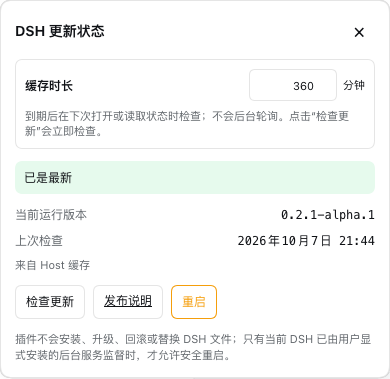
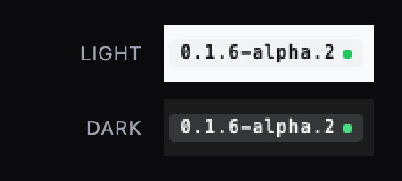

<h1 align="center">DSH Update Status</h1>

<p align="center">DeepSeek Harness Web 的版本状态、仅复制升级提示，以及需用户级服务监督的安全重启。</p>

<p align="center">
  <a href="https://www.npmjs.com/package/dsh-update-status"></a>
  <a href="https://github.com/idoall/dsh-update-status/actions/workflows/ci.yml"></a>
  <a href="LICENSE"></a>
</p>

<p align="center"><a href="README.md">English</a> | 中文</p>

<p align="center">
  <a href="#功能">功能</a> ·
  <a href="#安装">安装</a> ·
  <a href="#使用">使用</a> ·
  <a href="#更新检查">更新检查</a> ·
  <a href="#受监督的重启">受监督的重启</a> ·
  <a href="#局域网非回环页面访问">局域网访问</a> ·
  <a href="#兼容性">兼容性</a> ·
  <a href="#配置">配置</a> ·
  <a href="#故障排查">故障排查</a> ·
  <a href="#安全边界">安全边界</a> ·
  <a href="#卸载">卸载</a> ·
  <a href="docs/RELEASING.md">发布指南</a>
</p>

> DSH Update Status 是 DeepSeek Harness 社区插件。它不修改 DSH 核心，不会安装或升级 DSH、回滚 DSH 包、下载 release 或替换 DSH 文件；只有你显式安装并接管了当前 DSH Web 的用户级后台服务后，它才会请求一次受限的安全重启。

插件只把展开侧栏中的品牌名称换成适配 24px 品牌行的 `DeepSeek + 版本芯片`，官方鱼标保持不变。版本号旁的**绿点**表示正在运行的版本就是 npm 上最新的那一版；**橙色呼吸圆点**表示线上有更新的版本——无论是稳定版、RC 还是 Alpha。点击芯片即可看到当前运行版本、更新的版本、本插件是否验证过它、钉在该确切版本上的“仅复制”升级命令，以及只有装好用户级监督后才会出现的**重启**按钮。

<p align="center">
  
</p>

## 功能

- **侧栏版本状态**：展开侧栏显示当前 DSH 版本。收起侧栏时不渲染任何入口——DSH 的 `sidebar.footer.action` 是「设置」上方的一格 36px 位置，第二个注册者会把这一行撑破（实测把相邻插件的入口顶出了屏幕左缘），所以品牌行芯片是唯一入口。
- **安静的更新提示**：有新版本时**不改变版本 Badge 的背景**，只在版本号旁保留一个带小光晕的橙色圆点做放大缩小的呼吸动画（`prefers-reduced-motion` 下停用动画），让新版本表现为一盏小灯，而不是整条品牌行换色。
- **一眼三态**：没有可做的事时，版本号旁是**纯绿色小圆圈**（取主题 success 色，不再跟随文字色——暗色外壳下不会再出现一个看起来像「熄灭」的深色点）；检查中是中性灰呼吸点；有新版本才是橙色光晕呼吸点。只有更新态会动、会发光，也只有状态读取失败才会把 Badge 重绘成红色。
- **中性版本底框**：Badge 在明暗两套主题下都用灰色二级面（浅色 `#f1f3f5` / 深色 `#353638`）配主题常规文字色，所以暗色下是「深灰底 + 白字」，不再是会把橙色光晕吃掉的白框；只有状态读取失败时才会重绘成红色。
- **浅色 / 深色 / 跟随系统，自动适配**：插件渲染的每个颜色都是 DSH 语义令牌，Badge、圆点、光晕与面板都按 DSH 当前外观解析。DSH 设为浅色、深色或跟随系统，插件就跟着切换——插件侧没有自己的主题开关，也没有需要同步的媒体查询。hover 在两个方向上都是「抬起」：浅色下压深、深色下提亮（把主题文字色按比例混进底色实现）。
- **只有一条发布线、零配置**：一次 registry 请求读取 npm 的全部 dist-tags，只保留其中最新的版本——稳定版、RC、Alpha 一视同仁。没有需要关注的通道，也没有需要做的选择。
- **诚实的预发布比较**：运行版本与线上最新版本按 SemVer 排序，因此 `0.2.1-alpha.1` 高于 `0.2.0-rc.2`，而 RC 仍然低于它自己的正式版。
- **兼容性标识**：本插件验证过的版本显示“已验证兼容”；没验证过的更新版本显示“尚未验证兼容”，不冒充安全升级，而且这条提示永远不会重绘芯片。
- **仅复制命令**：根据安装来源，为**找到的那个确切版本**生成命令，不用会移动的 dist-tag，也从不执行。
- **缓存但不轮询**：Host 挂载时检查一次，缓存可设为 30–1,440 分钟并合并并发请求；前端没有轮询，只有“检查更新”按钮绕过缓存。
- **移动端可靠**：详情使用浏览器 modal top layer；底部 sheet 可滚动、适配 safe area，并保持在 DSH 抽屉上方。
- **受监督的安全重启**：一次性装好后台服务后，面板就能替你重启 DSH——它会先提醒会中断哪些工作，而终端直启或桌面应用托管的 DSH 会被直接拒绝。
## 安装

要求：

- 带 Web profile 的 DeepSeek Harness
- Node.js 20 或更新版本
- 已验证的 DSH 版本：`0.2.1-alpha.1`（当前）、`0.2.0-rc.2`、`0.2.0-rc.1`、`0.1.7-rc.2`、`0.1.7-rc.1` 与 `0.1.7-alpha.2`

已经安装 `dsh` 命令：

```sh
dsh plugin --profile web add dsh-update-status@latest
```

直接使用 DeepSeek Harness 源码：

```sh
corepack enable
pnpm install
pnpm dsh plugin --profile web add dsh-update-status@latest
```

安装后重启原有 DSH 进程，再刷新 Web GUI。不要为本插件启动第二个 Web server。

本地开发 link：

```sh
pnpm install --frozen-lockfile
pnpm run build
dsh plugin --profile web add "link:$(pwd)"
```

## 使用

1. 打开 DSH 左侧抽屉。官方鱼标仍在；名称行显示 `DeepSeek + 当前版本 Badge`。
2. 点击 Badge。面板打开时不会触发外层“新建会话”按钮。
3. 看当前运行版本。当它就是 npm 上最新的那一版时，面板会直接说明，并且不提供任何要执行的命令。
4. 当线上有更新的版本——稳定版、RC 或 Alpha 都一样——面板会给出它的版本号、发布时间，以及本插件是否验证过它。
5. 复制生成的命令（已钉在该确切版本上），在**运行 DSH 的那台电脑**的终端中自行执行。
6. 包管理器命令完成后，只有已完成[受监督的重启](#受监督的重启)接管时才使用面板里的**重启**；否则仍由你自行重启 DSH。

全局安装时可能生成：

```sh
npm install -g @deepseek-ai/dsh@0.2.1-alpha.1
```

插件只显示一条与检测到的安装方式匹配、并写明所查到确切版本号的命令，不会运行它。

### 圆点含义

版本号旁那颗圆点承载全部状态，且只有更新态会动：

| 圆点 | 状态 | 含义 |
| --- | --- | --- |
| 绿色小圆圈 | 已是最新 | 正在运行的版本就是 npm 上最新的那一版，芯片保持原底色。 |
| 灰点呼吸 | 检查中 | 状态读取正在进行（首次挂载，或点了**检查更新**）。 |
| 橙色圆点 + 光晕 | 有更新 | 线上有更新的版本。自行复制命令、执行，然后重启 DSH。 |
| 芯片变红 | 读取失败 | 插件无法判定状态：registry 读取失败，或两个版本无法按 SemVer 比较。**未验证兼容**的更新版本不属于这一档——它只是面板里的提示。 |

<p align="center">
  
</p>

芯片本身是中性二级面——两套主题都是灰色，文字用主题常规色——所以橙色光晕始终看得清，而且它绝不会为了宣布更新而改变颜色。

## 更新检查

插件按缓存周期向 npm registry 请求一次 `@deepseek-ai/dsh`，取出**所有 dist-tag 指向的最新版本**，再与正在运行的版本比较。`latest`、`next`、`alpha` 是 npm 自己的记账方式，不是需要用户做的选择：哪个 tag 上挂着更新的版本，就报哪个。

- 取 SemVer 最高者（含预发布）：因此跑到稳定版前面的 `alpha` 会被提示，而不是被藏起来。
- 比较是精确的：`0.2.1-alpha.1` 比 `0.2.0-rc.2` 新，两者都低于 `0.2.1`。
- 插件没听说过的 dist-tag 同样计入——读取的是 npm 返回的全部 tag，不是写死的三个。
- 只有本插件验证过的版本才标注“已验证兼容”；没验证过的更新版本会带上“尚未验证兼容”的提示（`notice`，永远不会重绘芯片）。
- 面板与设置区块渲染同一个答案；升级命令写明所查到的确切版本。

这里不会安装任何东西。跟随某条通道——以及保存它的 `channel` 偏好——已在 `0.2.0` 移除。

## 受监督的重启

插件没法自己重启 DSH：它就住在那个要被换掉的进程里。所以只有让操作系统来托管这个进程，按钮才有意义——而每个系统本来就自带这个能力。

最短且安全的接管流程是显式在终端执行：

```sh
# 1. 只预览完整的原生服务计划：不写文件，不启动服务。
dsh plugin --profile web exec dsh-update-status-service plan \
  --workspace "$PWD" --dry-run

# 2. 只落盘用户服务定义：仍然不会启动它。
dsh plugin --profile web exec dsh-update-status-service install \
  --workspace "$PWD"

# 3. 由你自己在旧终端停止直启的 dsh web，再激活服务。
dsh plugin --profile web exec dsh-update-status-service activate
```

`activate` 发现端口还被占着就停手，绝不去杀进程，所以你正在用的 DSH 不会被突然掐掉；激活之后它还会确认服务真的接管了——一启动就不停失败的服务会被当作失败报出来，而不是假装成功。这之后就交给**重启**按钮：它先列出正在跑的东西，有东西在跑时再问一次，然后才让 DSH 退出；服务把新的拉起来，页面自己回来。

同一个端口只允许一个启动者。如果别的工具自己拉起了 `dsh web`——另一个插件的重启助手、`nohup` 脚本——那个进程会占着端口，而你的服务会一直启动失败。插件会直接问操作系统「这个服务真正拥有的是哪个进程」，所以这种情况下**重启**按钮会保持禁用，而不是承诺一个做不到的恢复；同时它会给出两条只复制的命令：一条找出谁占着端口，一条把服务交还回去。生成的服务在连续几次启动失败后也会停下来（不再无限重拉），并把原因写进自己的日志。设置页会显示服务启动时间，刚重启和跑了很久的实例一眼就能分清。更多细节见[用户服务监督说明](docs/service-supervision.md)。

| 平台 | 用户级拥有者 | 启动时机 | 接管后页面重启 | 说明 |
| --- | --- | --- | --- | --- |
| macOS | `launchd` LaunchAgent | 用户登录 | 可以 | 已真机验证；不需要管理员。 |
| Linux | `systemd --user` | 用户登录 | 已实现；请在你自己机器上验证 | 想在登出后继续运行，可自行开启 `loginctl enable-linger`（本插件不会替你开）。 |
| Windows | 任务计划程序 + 当前用户 wrapper | 用户登录 | 已实现；请在你自己机器上验证 | 不需要管理员。 |

生成的服务文件里只有绝对路径、一条可审计的 `PATH`，以及**没有密钥**——不会带上你终端里的 API key、npm token、cookie 或代理凭据。默认情况下，`install` 会保存执行安装命令的终端 PATH，因此 Homebrew、MacPorts、Nix、asdf、Conda、Cargo 和手工安装走的是同一套规则；`--path-source minimal` 保留固定环境，`--service-path` 则使用你明确给出的完整 PATH。`plan --dry-run` 会在写文件前列出最终值和全部提示。原生文件、日志、状态与卸载见[用户服务监督说明](docs/service-supervision.md)；想在 Linux 或 Windows 上自己确认，见[跨平台验收步骤](docs/platform-acceptance.md)。

重启会中断正在跑的工作，且不会保存。如果 DSH 列不出正在跑什么、无法确认当前进程确实由你装的服务拥有，或者它本来就是终端直启、桌面应用托管的，它会直接拒绝重启——网页端说什么都没用。

## 局域网（非回环页面）访问

DSH 对来源不是 loopback（`localhost` / `127.0.0.1`）的页面会关闭 Host 设置持久化（官方 `dsh-client-ui-settings` README 原文：*Non-loopback pages get no durable settings*）：所有按条目寻址的设置表单（`ctx.configForms.get(id)`，DSH 0.1.7 中已移除的 `settingsScope` 服务的继任者）此时被固定为 `memory`，直接返回 `unavailable`，并且从此不发 `settings.describe`；整页的 `connection.isLoopback` 也都是 false。

从 `0.1.2` 起，本插件在局域网页面同样可用：

- **版本/更新状态**照常读取。早先的版本把整个功能压在 `connection.isLoopback === true` 上，于是经局域网转发（`dsh-bridge`、`dsh-lan-proxy` 等）打开的页面从不发送 `POST /api/dsh-update-status.get-status`、详情面板打不开，还会把本包声明的兼容版本当成"当前运行版本"显示。该判断已移除——Connection RPC 本身是已认证的，Host 路由也是本插件自己的路由。
- **偏好设置**（`sidebarEnabled`、`cacheTtlMinutes`）继续读写 Host 上共享的那一份 `dsh-update-status` 设置条目，走的是与官方设置表单相同的公开 Remote（`settings.describe` / `settings.mutate`）。写入仍受 revision 栅栏保护，被拒时明确提示冲突而不会静默覆盖。直连通道只在官方表单报 `unavailable` 时才打开，所以回环页面仍走官方路径，不会多发一次线上读取。

若你希望保持 DSH 官方策略（非回环页面完全不落地设置），可以让转发侧声明宿主身份：在返回的 HTML 中、`__DSH_BOOT__` 之前注入 `window.__DSH_TRANSPORT__ = { fetch: (input, init) => window.fetch(input, init), ownsHost: true }`。DSH 的 `ctx.connection.isLoopback` 会据此为真，所有依赖设置的界面（含官方「设置」页）一并恢复；`dsh-mobile` 网关正是这么做的。

## 兼容性

当前发布：插件 **`0.4.1`** 已针对 DeepSeek Harness **`0.2.1-alpha.1`**（当前发布版）、**`0.2.0-rc.2`**、**`0.2.0-rc.1`**、**`0.1.7-rc.2`**、**`0.1.7-rc.1`** 与 **`0.1.7-alpha.2`** 验证。

### 插件版本与 DeepSeek Harness 版本的对应关系

| 插件版本 | 已验证的 DeepSeek Harness | npm 发布状态 | 该版本是什么 |
| --- | --- | --- | --- |
| **`0.4.1`** | `0.2.1-alpha.1`、`0.2.0-rc.2`、`0.2.0-rc.1`、`0.1.7-rc.2`、`0.1.7-rc.1`、`0.1.7-alpha.2` | `latest` | 安装服务时保存当时使用的 PATH，不论工具由哪种包管理器安装，受托管后仍能找到 |
| **`0.4.0`** | `0.2.1-alpha.1`、`0.2.0-rc.2`、`0.2.0-rc.1`、`0.1.7-rc.2`、`0.1.7-rc.1`、`0.1.7-alpha.2` | 已发布 | 重启变得靠得住：服务连续失败会停下而不是无限重启；按钮要求系统服务真正托管当前进程；禁用时会给出两条可复制的恢复命令。设置页还能看到服务启动时间 |
| **`0.3.2`** | `0.2.1-alpha.1`、`0.2.0-rc.2`、`0.2.0-rc.1`、`0.1.7-rc.2`、`0.1.7-rc.1`、`0.1.7-alpha.2` | 已发布 | 只改文档：版本对照表和历史发布说明都改成人话。功能与 `0.3.1` 完全一样 |
| **`0.3.1`** | `0.2.1-alpha.1`、`0.2.0-rc.2`、`0.2.0-rc.1`、`0.1.7-rc.2`、`0.1.7-rc.1`、`0.1.7-alpha.2` | 已发布 | 小补丁：设置页也说明了重启前提，长任务名不再把按钮挤走。 |
| **`0.3.0`** | `0.2.1-alpha.1`、`0.2.0-rc.2`、`0.2.0-rc.1`、`0.1.7-rc.2`、`0.1.7-rc.1`、`0.1.7-alpha.2` | 已发布 | 面板新增**重启**，以及它需要的那条服务安装命令；没装服务时按钮保持禁用并说明原因。 |
| **`0.2.1`** | `0.2.1-alpha.1`、`0.2.0-rc.2`、`0.2.0-rc.1`、`0.1.7-rc.2`、`0.1.7-rc.1`、`0.1.7-alpha.2` | 已发布 | 隐藏版本芯片后，品牌行恢复成 DSH 官方的名称与鱼标，而不是变成空白。 |
| **`0.2.0`** | `0.2.1-alpha.1`、`0.2.0-rc.2`、`0.2.0-rc.1`、`0.1.7-rc.2`、`0.1.7-rc.1`、`0.1.7-alpha.2` | 已发布 | 从「通道目录」改成「一条发布线」：面板只报 npm 上最新的版本，没有需要配置的东西。 |
| **`0.1.12`** | `0.2.0-rc.2`、`0.2.0-rc.1`、`0.1.7-rc.2`、`0.1.7-rc.1`、`0.1.7-alpha.2` | 已发布 | 把 DSH `0.2.0-rc.2` 加入已验证清单；代码无改动。 |
| **`0.1.11`** | `0.2.0-rc.1`、`0.1.7-rc.2`、`0.1.7-rc.1`、`0.1.7-alpha.2` | 已发布 | 声明 DSH `0.2.0` 线并放宽支持范围，避免更新的 DSH 一声不响地把插件丢掉。 |
| **`0.1.10`** | `0.1.7-rc.2`、`0.1.7-rc.1`、`0.1.7-alpha.2` | 已发布 | 收起侧栏的窄轨里不再放按钮——那里放不下，还会把相邻插件的图标挤开。 |
| `0.1.9` | `0.1.7-rc.2`、`0.1.7-rc.1`、`0.1.7-alpha.2` | 已发布 | 修复升级 DSH 后插件消失（安装目录里残留的共享库副本会把它带崩）；设置页现在会告诉你要删哪个目录。 |
| `0.1.8` | `0.1.7-rc.2`、`0.1.7-rc.1`、`0.1.7-alpha.2` | 已发布 | 把 DSH `0.1.7-rc.2` 加入已验证清单；代码无改动。 |
| `0.1.7` | `0.1.7-rc.1`、`0.1.7-alpha.2` | 已发布 | 英文界面不再混入中文：状态提示改由浏览器按自己的语言渲染。 |
| `0.1.6` | `0.1.7-rc.1`、`0.1.7-alpha.2` | 已发布 | 适配 DSH 0.1.7：插件的两个偏好改存成它自己的设置条目。 |
| `0.1.5` | `0.1.6-alpha.2`、`0.1.6-alpha.1`、`0.1.5-rc.1` | 已发布 | 一颗圆点承载全部状态（绿=最新、灰=检查中、橙=有更新），提示性说明不再重绘芯片。 |
| `0.1.4` | `0.1.6-alpha.1`、`0.1.5-rc.1` | 已发布 | 修复「正在运行的版本」显示成不可选。 |
| `0.1.3` | `0.1.6-alpha.1`、`0.1.5-rc.1` | 已发布 | 带上局域网页面的修复，并在 DSH 0.1.6 上复验。 |
| `0.1.2` | `0.1.5-rc.1` | **未发布** | 去掉「仅回环」的限制，局域网页面也能用。 |
| `0.1.1` | `0.1.5-rc.1` | 已发布 | 此前的 npm 最新版；局域网页面上插件不工作。 |
| `0.1.0` | `0.1.2-rc.1` | 已发布 | 首个版本。 |
- **哪个版本配哪个 DSH？** `0.1.6`–`0.1.10` 用于 DSH `0.1.7` 线；`0.1.11` 及以后同时声明 `0.2.0` 线。DSH 0.1.7 改了插件设置的存储方式，所以在更早的 DSH（含 `0.1.6-alpha.2`）上请留在插件 **`0.1.5`**。
- **「已验证」** 指这个版本确实和那个 DSH 发布版一起测过。清单里没有的版本会标成「尚未验证兼容」——只是面板里的提示，绝不会重绘芯片，所以 DSH 先升、插件后跟是安全的。真遇到不兼容，请禁用或卸载插件，不要去改 DSH 本体。（这份清单存放在 `package.json` 与 `src/shared/types.ts`，有测试保证两者一致。）
- **npm 发布状态** 指 `dsh plugin --profile web add dsh-update-status@latest` 实际会装到的版本；只存在于仓库、尚未发布的版本属于开发状态。

- 需要精确对应时显式指定版本：

  ```sh
  dsh plugin --profile web add dsh-update-status@0.3.2   # DSH 0.2.1-alpha.1
  dsh plugin --profile web add dsh-update-status@0.2.0   # DSH 0.2.1-alpha.1、0.2.0-rc.2、0.2.0-rc.1、0.1.7-rc.2、0.1.7-rc.1 或 0.1.7-alpha.2
  dsh plugin --profile web add dsh-update-status@0.1.12 # DSH 0.2.0-rc.2、0.2.0-rc.1、0.1.7-rc.2、0.1.7-rc.1 或 0.1.7-alpha.2
  dsh plugin --profile web add dsh-update-status@0.1.11 # DSH 0.2.0-rc.1、0.1.7-rc.2、0.1.7-rc.1 或 0.1.7-alpha.2
  dsh plugin --profile web add dsh-update-status@0.1.10  # DSH 0.1.7-rc.2、0.1.7-rc.1 或 0.1.7-alpha.2
  dsh plugin --profile web add dsh-update-status@0.1.9   # DSH 0.1.7-rc.2、0.1.7-rc.1 或 0.1.7-alpha.2
  dsh plugin --profile web add dsh-update-status@0.1.8   # DSH 0.1.7-rc.2、0.1.7-rc.1 或 0.1.7-alpha.2
  dsh plugin --profile web add dsh-update-status@0.1.7   # DSH 0.1.7-rc.1 或 0.1.7-alpha.2
  dsh plugin --profile web add dsh-update-status@0.1.6   # DSH 0.1.7-rc.1 或 0.1.7-alpha.2
  dsh plugin --profile web add dsh-update-status@0.1.5   # DSH 0.1.6-alpha.2、0.1.6-alpha.1 或 0.1.5-rc.1
  dsh plugin --profile web add dsh-update-status@0.1.4   # DSH 0.1.6-alpha.1 或 0.1.5-rc.1
  dsh plugin --profile web add dsh-update-status@0.1.0   # 仅 DSH 0.1.2-rc.1
  ```

- 有两处声明让已验证的版本线能正常加载，并由测试守住：
  - `dsh.engines.dsh` 与 `peerDependencies['@deepseek-ai/dsh-settings']` 都声明 `>=0.1.7-alpha.2 <0.3.0`，六个已验证版本都在范围内。下界特意写成这个 alpha：按 node-semver 默认的预发布规则，`>=0.1.6-0 <0.2.0` 这样的范围**并不接纳** `0.1.7-alpha.2`。上界在 `0.1.11` 从 `<0.2.0` 放宽到 `<0.3.0` 是同一件事的镜像：DSH 会在 profile 加载时拒绝不兼容的 bundle，而裸的 `<0.2.0` 恰好排除 `0.2.0` 正式版——DSH `0.2.0` 发布当天插件就会被静默丢弃。DSH 判定时使用 `includePrerelease: true`，所以 `0.2.0-rc.2` 本来就在这个范围内，`0.1.12` 无需再动范围；反过来说，把范围写成 `... || 0.2.0-rc.1 || >=0.2.0 <0.3.0` 这类枚举的插件会因为 `>=0.2.0` 不接纳 `0.2.0` 预发布而被 rc.2 拒载。
  - `@deepseek-ai/schemastery` 是 **peer**，不是普通依赖：DSH 0.1.7 只从运行安装解析 link 插件的 peer 依赖，否则 `link:` 安装会连 Host 半边都 import 失败。
- 每个版本的中英文详细说明（改了什么、影响谁、需要做什么）手写后直接作为 GitHub Release 正文：[`v0.3.0`](https://github.com/idoall/dsh-update-status/blob/main/docs/releases/v0.3.2.md) · [v0.3.1](https://github.com/idoall/dsh-update-status/blob/main/docs/releases/v0.3.1.md) · [v0.3.0](https://github.com/idoall/dsh-update-status/blob/main/docs/releases/v0.3.0.md) · [`v0.2.1`](https://github.com/idoall/dsh-update-status/blob/main/docs/releases/v0.2.1.md) · [`v0.2.0`](https://github.com/idoall/dsh-update-status/blob/main/docs/releases/v0.2.0.md) · [`v0.1.12`](https://github.com/idoall/dsh-update-status/blob/main/docs/releases/v0.1.12.md) · [`v0.1.11`](https://github.com/idoall/dsh-update-status/blob/main/docs/releases/v0.1.11.md) · [`v0.1.10`](https://github.com/idoall/dsh-update-status/blob/main/docs/releases/v0.1.10.md) · [`v0.1.9`](https://github.com/idoall/dsh-update-status/blob/main/docs/releases/v0.1.9.md) · [`v0.1.8`](https://github.com/idoall/dsh-update-status/blob/main/docs/releases/v0.1.8.md) · [`v0.1.7`](https://github.com/idoall/dsh-update-status/blob/main/docs/releases/v0.1.7.md) · [`v0.1.6`](https://github.com/idoall/dsh-update-status/blob/main/docs/releases/v0.1.6.md) · [`v0.1.5`](https://github.com/idoall/dsh-update-status/blob/main/docs/releases/v0.1.5.md) · [`v0.1.4`](https://github.com/idoall/dsh-update-status/blob/main/docs/releases/v0.1.4.md) · [`v0.1.3`](https://github.com/idoall/dsh-update-status/blob/main/docs/releases/v0.1.3.md)（含从未发布的 `0.1.2`）。

## 配置

| 选项 | 默认值 | 范围 / 行为 |
| --- | --- | --- |
| `cacheTtlMinutes` | `360` | 30–1,440 分钟；仅在下一次按需读取时判断是否到期，绝不启动后台定时器 |
| `sidebarEnabled` | `true` | 只隐藏本插件自己的侧栏入口；隐藏期间品牌行恢复为 DSH 官方鱼标与字标 |

**设置 → 版本与更新** 显示当前运行版本、检查结论与升级命令，并可隐藏本插件侧栏入口（隐藏期间品牌行恢复为 DSH 官方内容）；详情面板中另可填写缓存时长。修改缓存时长不会请求网络；只在之后普通读取且缓存已到期时更新，“检查更新”始终是立即手动检查。

偏好只会在你于面板或该设置区块中主动选择时写入。插件没有任何自动写入路径——没有 effect、定时器，也不在挂载时写入，并由 `tests/client/entry.spec.ts` 挂载真实客户端入口长期守住这一点。在 DSH 0.1.7 上，上面两个偏好就是本插件条目 `Config` 的 **volatile** 字段，因此以该条目的 `config` 落在当前 profile 的 patch 里（`~/.dsh/profiles/<profile>/cordis.patch.yml`）；要重置某个偏好，直接修改或删除该段即可，DSH 会在下次变更时重新加载 profile。`Config` 的其余字段只用于部署、不会出现在表单中：`cacheTtlHours`（默认 `6`）、`timeoutMs`（默认 `15000`）与 `autoCheckOnMount`（默认 `true`），同样写在同一份 profile patch 中。

## 故障排查

**胶囊显示的版本不是我刚装的，而且点了没有反应。**
这是插件 `0.1.1` 及更早版本的 `connection.isLoopback` 门控：在非回环页面（如 `dsh-bridge`、`dsh-lan-proxy` 这类局域网转发）上整个插件会失效，胶囊退回显示本包声明的兼容版本。先确认已装版本再升级：

```sh
node -p "require(process.env.HOME + '/.dsh/profiles/web/node_modules/dsh-update-status/package.json').version"   # 需要 0.1.3 或更新
dsh plugin --profile web add dsh-update-status@latest
```

**升级 DSH 之后芯片变红了。**
在 `0.1.5` 及更新版本上，红色只代表一件事：插件无法判定状态——registry 读取失败，或两个版本无法按 SemVer 比较。`0.1.4` 及更早版本的判定更宽：客户端把**任何**警告都当成故障，而「这个预览版尚未验证与本插件兼容」正是 DSH 版本比插件清单更新时必然产生的警告。所以「DSH 先升级、插件还没跟上」就会把芯片涂红，哪怕读取其实成功了。`0.1.5` 把两者分开——`failure` 仍然重绘，提示只留在面板——因此长期让 DSH 领先的用法请升级：

```sh
dsh plugin --profile web add dsh-update-status@latest
```

在那之前这条提示无害：它只出现在面板里，等后续插件版本把你正在使用的 DSH 版本列入已验证清单后就会自动消失。

**版本一直不变。**
Host 会缓存一次 registry 响应，默认 360 分钟，且只有普通读取才会判断到期。点**检查更新**可立即刷新，或调小 `cacheTtlMinutes`。检查失败时会保留上一次成功缓存，并在版本号旁显示警告。

**完全连不上 npm registry。**
插件会报告失败，并仍然显示本地检测到的运行版本。registry 访问只允许 HTTPS 的 `registry.npmjs.org`；代理或离线环境会给出这条警告，而不是编造一个版本号。

**升级之后插件整个消失了，宿主日志里是 `volatile is not a function`。**
`0.1.5` 及更早版本把 `@deepseek-ai/schemastery` 声明为普通依赖；从 `0.1.6` 起它是**由 DSH 提供的 peer**，而 DSH 给它加的 `volatile()` 正是把三个偏好变成这个条目设置表单的机制。如果该包的一份旧副本被留在插件自己的安装目录里（用本地目录安装时被一起拷进来的 dev `node_modules`，pnpm 永远不会清理），Node 就会解析到那份旧副本，缺失的方法在宿主半 import 阶段直接抛错，插件在来得及报告任何信息之前就消失了。新版本改为显式解析平台那份，两种情况都能加载；只找得到旧副本时，面板会给出 `stale-schemastery` 提示并指出该删除哪个目录。删除残留目录后重启 DSH：

```sh
rm -rf ~/.dsh/profiles/<profile>/node_modules/dsh-update-status/node_modules
```

## 安全边界

- registry 访问只允许 HTTPS `registry.npmjs.org`，并拒绝重定向。
- Host 只通过 DSH 已认证的 Connection RPC 返回普通 JSON。
- 不注册公共 Remote Service，也不注册模型 Tool。
- 插件代码不会启动 npm/pnpm 子进程。
- `canApplyInPlace` 恒为 `false`。
- 插件不会安装、升级、回滚或替换 DSH 文件。单独、显式执行的服务 CLI 只会落盘当前用户的服务定义，绝不会杀掉占用端口的 DSH。
- 重启是只接受 POST 的已认证 Connection RPC，并由服务端同时检查明确的原生服务标记与平台身份；终端直启、桌面版、未知环境或无法完整检查活动工作时均拒绝退出。
- 刷新失败时保留最后一次成功缓存并显示警告；冷启动失败也会保留本地版本信息。

## 卸载

```sh
dsh plugin --profile web remove dsh-update-status
```

重启 DSH 并刷新 Web GUI。卸载不会删除偏好：要清空偏好，请从当前 profile 的 `cordis.patch.yml` 中删除 `dsh-update-status` 条目的 `config` 段。

## 开发

```sh
pnpm install --frozen-lockfile
pnpm run test
pnpm run build
pnpm pack --dry-run
```

发布 tag 使用 npm Trusted Publishing 与 GitHub OIDC。请按 [docs/RELEASING.md](docs/RELEASING.md) 在 npm 网站一次性绑定 Trusted Publisher，随后推送匹配的 `vX.Y.Z` tag；仓库不保存长期 npm token。

MIT，详见 [LICENSE](LICENSE)。
